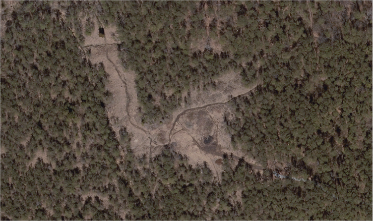
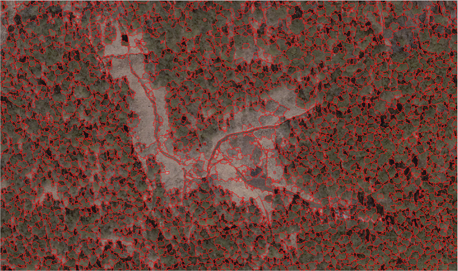

# BareHills_SerpentineBarrens
Geographic Object-Based Image Analysis (GEOBIA) to identify vegetation in serpentine barrens near Lake Roland, MD.

**Raw Image**
<p align="center">
  
</p>

**Segmented Image**
<p align="center">
  
</p>

## Packages
GEOBIA packages in Python 3.6 include RSGISLib, GDAL, Fiona, Shapely and RIOS libraries.

For this project Orfeo ToolBox will be utilized.

#### Large-Scale Mean-Shift (LSMS) segmentation


-Use the steps in "OTB_Segmentation.txt" to run the segmentation algorithm

## Installation and Running OTB in Python

### Download OTB and Run the batch file for the otb environment
The otbApplication python library cannot be installed via pip or conda, and works in either version 2.7 and 3.5

Download OTB from here: https://www.orfeo-toolbox.org/download/

Extract the contents to C:\OTB (or another folder of your choice)

Run the batch file "C:\OTB\otbenv.bat" from the command line in Windows in order to use the OTB commands in the CMD. This should set everything up for you correctly. If you receive any errors about locating DLL's you may have to follow the steps below to manually enter the patah system variables.
```
C:\OTB\otbenv.bat
```
(if this is where you unzipped the downloaded application)

### Add these paths to System variables
(Alter the paths according to where you placed your OTB installation)
```
1. PYTHONPATH > C:\OTB\lib\python3 (if this doesn't work try C:\OTB\lib\python3\otbApplication.py)
2. Path > C:\OTB\bin
3. OTB_APPLICATION_PATH > C:\OTB\lib\otb\applications
```
**If using PyCharm**, also add these paths to the project interpreter using the method linked below:
https://stackoverflow.com/questions/19885821/how-do-i-import-modules-in-pycharm

### Create a new Conda environment
```
conda create -n OTB python=3.5 anaconda
activate OTB
conda install numpy gdal
```
