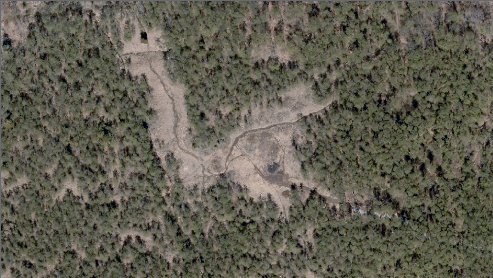
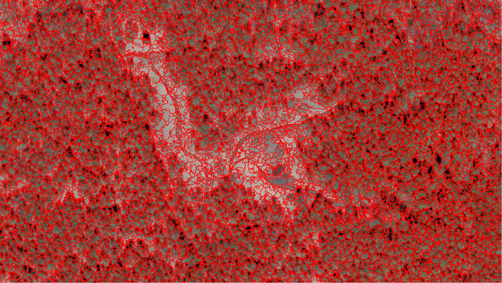
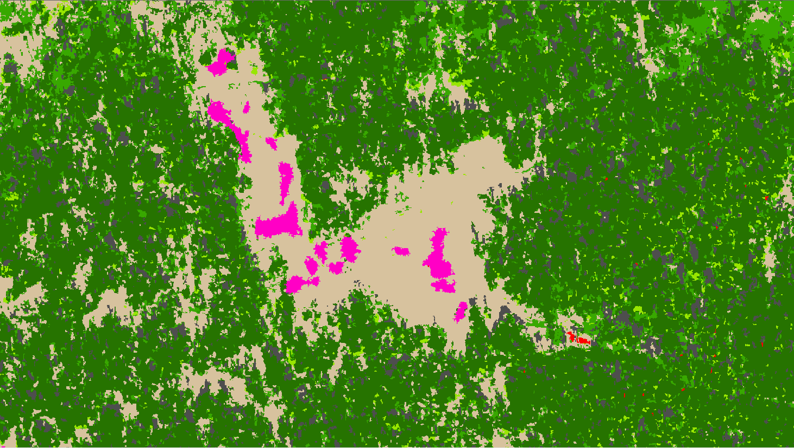
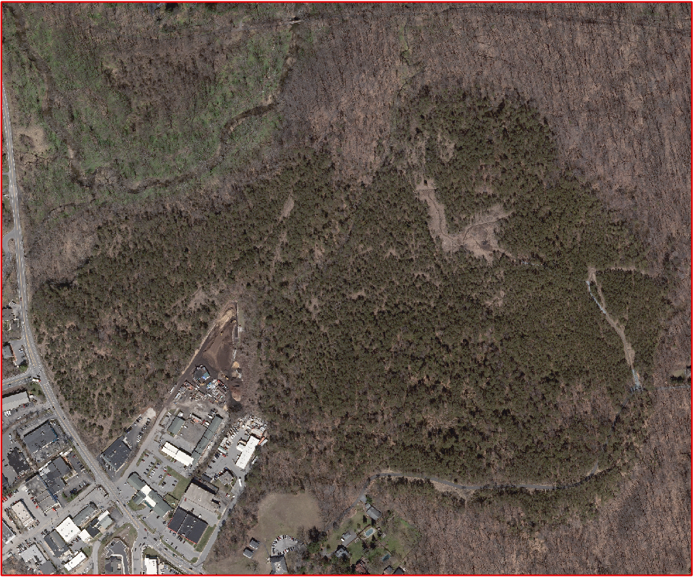
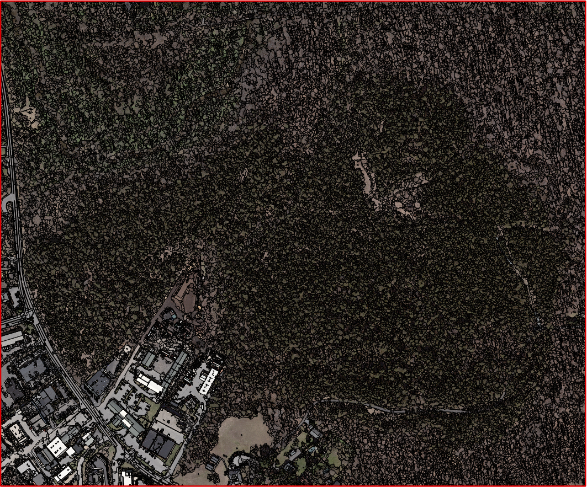
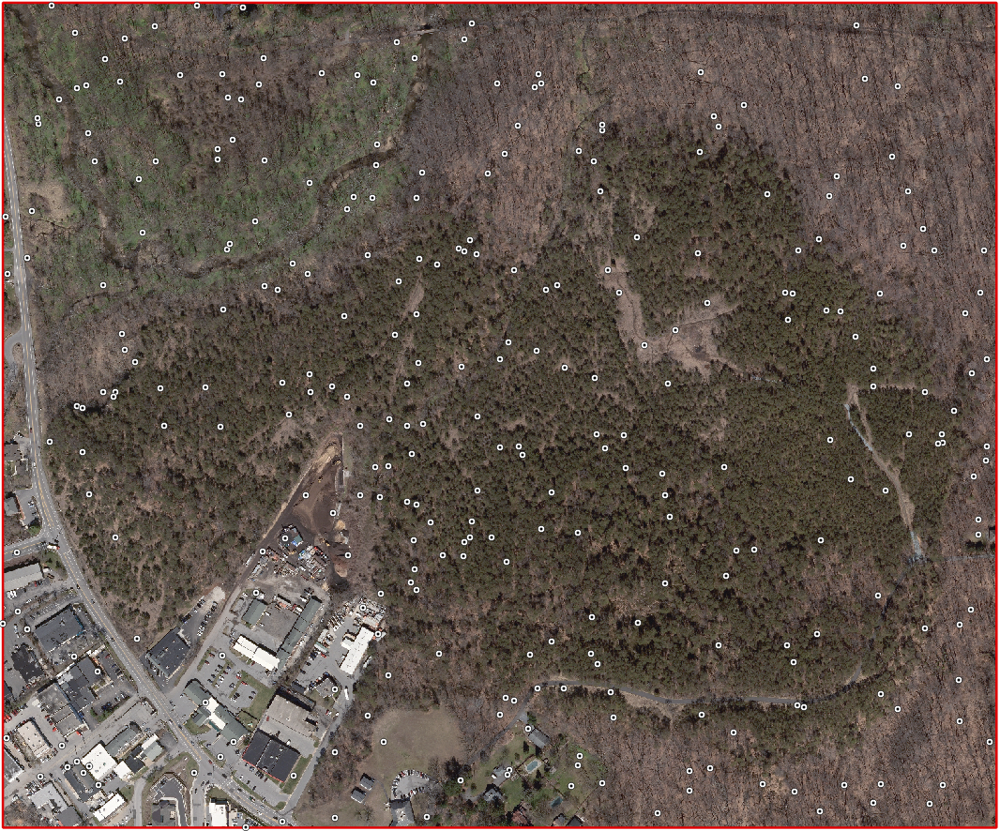
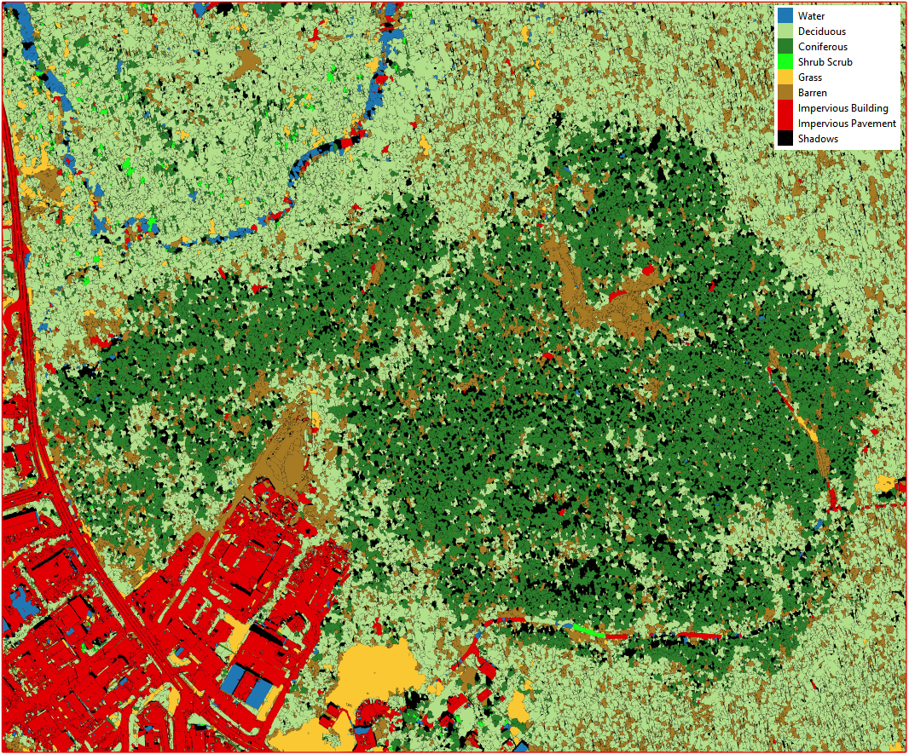
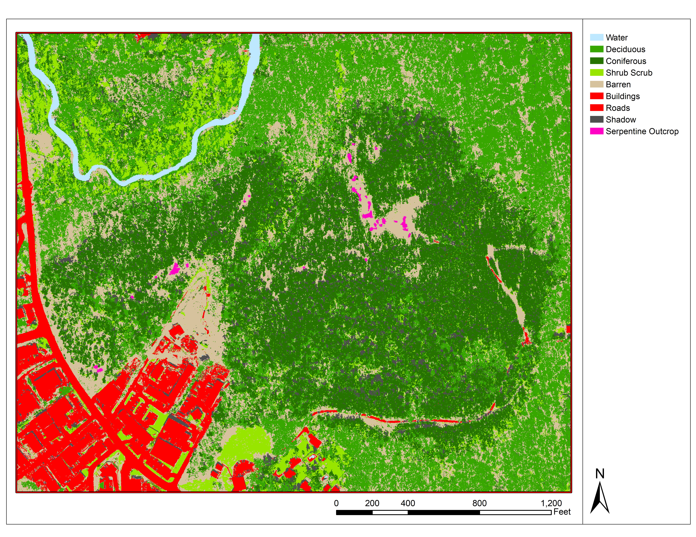

# BareHills_SerpentineBarrens
Geographic Object-Based Image Analysis (GEOBIA) to identify vegetation in serpentine barrens near Lake Roland, MD.

## Packages
GEOBIA, remote sensing, and general raster analysis libraries in Python 3.5 include but not limited to otbApplication, rasterio, RSGISLib, GDAL, Fiona, Shapely and RIOS.

For this project Orfeo ToolBox (otbApplication) was utilized to radiometrically segment the image. The segment properties were then pulled into R, where a random forest classifier placed each segment into a predicted land cover category.

#### Large-Scale Mean-Shift (LSMS) segmentation

* Use the steps in "OTB_Segmentation.txt" to run the segmentation algorithm

## Installation and Running OTB in Python

### Download OTB and Run the batch file for the otb environment
The otbApplication python library cannot be installed via pip or conda, and works in either version 2.7 and 3.5

Download OTB from here: https://www.orfeo-toolbox.org/download/

Extract the contents to C:\OTB (or another folder of your choice)

Run the batch file "C:\OTB\otbenv.bat" from the command line in Windows in order to use the OTB commands in the CMD. This should set everything up for you correctly. If you receive any errors about locating DLL's when trying to import otbApplication in Python, you may have to follow the steps below to manually enter the path system variables.
```
C:\OTB\otbenv.bat
```
(if this is where you unzipped the downloaded application)

### Add these paths to System variables
(Alter the paths according to where you placed your OTB installation)
```
1. PYTHONPATH > C:\OTB\lib\python3 (if this doesn't work try C:\OTB\lib\python3\otbApplication.py)
2. Path > C:\OTB\bin
3. OTB_APPLICATION_PATH > C:\OTB\lib\otb\applications
```
**If using PyCharm**, also add these paths to the project interpreter using the method linked below:
https://stackoverflow.com/questions/19885821/how-do-i-import-modules-in-pycharm

### Create a new Conda environment
```
conda create -n OTB python=3.5 anaconda
activate OTB
conda install numpy gdal
```
## Output

**Raw Image**
<p align="center">
  
</p>

**Segmented Image**
<p align="center">
  
</p>

**Classified Image**
<p align="center">
  
</p>

**Processing Methods**
Segment the image in the area of interest using spatial and radiometric properties using OTB segmentation in Python. Create 500 random points across the image, and classify them based on the criteria below. Spatially join the point classes to the vector segments, and train the vector classifier in R to identify radiometric properties to these classes. Run the vector classifier to classify the image.

The vector classifier used in this analysis is the R Random Forest library (randomForest_4.6-14). The training dataset was subdivided into 80% of the dataset used to train the model and 20% for validation of model performance. The highest performing classification model acheived 84% accuracy, and only classified: Water, Trees, Grass/Shrub, Barren, Impervious or Shadow. After classification,road, building, stream and serpentine outcrop polygons obtained via ground truthing were burned into the final classification vector data.

Below are the all of the classifications considered.

 1. Water
 2. Deciduous
 3. Coniferous
 4. Shrub Scrub
 5. Grass
 6. Barren
 7. Impervious Building
 8. Impervious Pavement
 10. Shadow
 11. Other Vegetation
 12. Serpentine Vegetation
 13. Serpentine Outcrop

Below are the raster bands used in the classification (mean and variance of each, 14 total parameters).

1. Red
2. Blue
3. Green
4. Near Infrared (NIR)
6. Normalized Difference Vegetation Index (NDVI)
7. LiDAR Intensity
8. LiDAR derived normalized digital surface model (nDSM, canopy height)

***Visualized Process***
<p align="center">
  
  
</p>

<p align="center">
  
  
</p>

**Final Map**
<p align="center">
  
</p>
  


